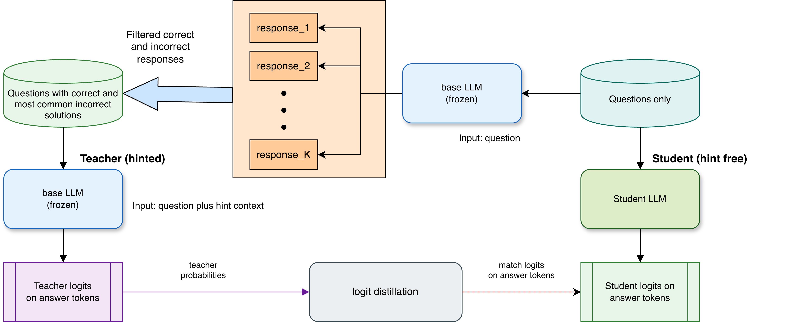

# Semantic Soft Bootstrapping (SSB)

🔗 Paper link: [Arxiv preprint](https://arxiv.org/abs/2507.02851)

🔗 Link to the trained models: [Hugging Face collection](https://huggingface.co/collections/purbeshmitra/motif-paper-models-686a2f36407bb88f750eef75)

In this work, we propose a GRPO based training method for such a system that allows to calculate the accuracy reward by rolling out trajectories and applying the reward at the first round of inference outcomes. This is depicted as following:
<p align="center">
  
</p>

Our results are shown below:
<p align="center">
  
</p>

## Citation
If you find our work useful, consider citing it as:
```bibtex
@article{mitra2025semantic,
  title={Semantic Soft Bootstrapping: Long Context Reasoning in LLMs without Reinforcement Learning},
  author={Mitra, Purbesh and Ulukus, Sennur},
  journal={arXiv preprint arXiv:},
  year={2025}
}
```
