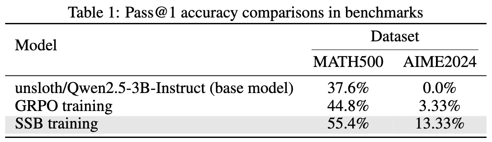
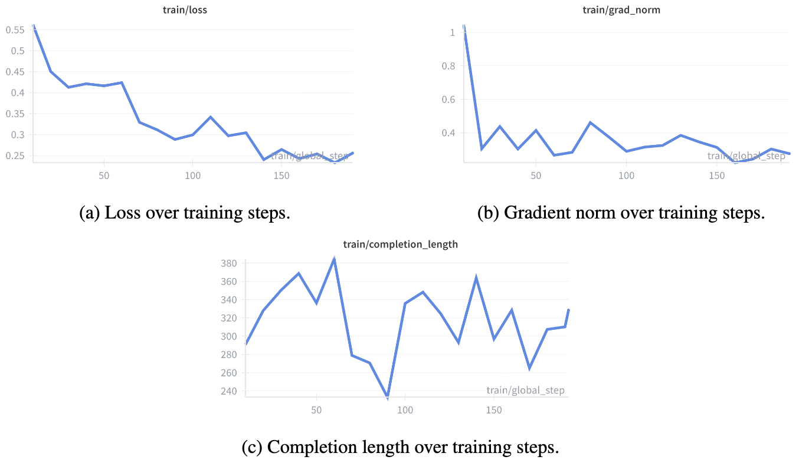

# Semantic Soft Bootstrapping (SSB)

🔗 Paper link: [Arxiv preprint](https://arxiv.org/abs/2512.05105)

🔗 Link to the trained model: [SSB trained model](https://huggingface.co/purbeshmitra/semantic-soft-bootstrapping)

🔗 Link to the SSB training data: [SSB teacher data](https://huggingface.co/datasets/purbeshmitra/ssb_teacher_data)

---
**Goal:** teach a small LLM to solve math problems *without hints* by distilling from its own **hinted** solutions.

* Generate a set of correct and incorrect responses to reasoning questions
* **Teacher = base model with hints** (problem + correct + incorrect traces)
* **Student = same base model, LoRA on top, no hints** (question only)
* Training is **RL-free**: no reward model, no GRPO/PPO, just offline logit matching.
* Using the power of in-context learning for generating dense training signal.

---

## Pipeline

<p align="center">
  
</p>

### 1. Generate robust teacher traces (SSB data)

For each problem `(question, final_answer)` from a math dataset:

* **Rollouts (no hints):**

  * Query the base model with a math-tutor system prompt + question only.
  * Sample `K` rollouts with temperature sampling.
  * Parse `\boxed{...}` to get predicted answers.

* **Filter:**

  * Label rollouts as *correct* / *incorrect* by comparing to the ground-truth final answer.
  * Keep only problems with at least 1 correct and 1 incorrect rollout.

* **Semantic bootstrapping step:**

  * Pick one correct trace and one representative incorrect trace (e.g. majority wrong answer).
  * Build a “hinted” prompt containing: problem + correct trace + incorrect trace.
  * Ask the same model (teacher role) to produce a **single robust, step-by-step solution**.
  * Keep only if the final `\boxed{}` answer is still correct.

* **Save teacher / student views:**

  * **Teacher example:** chat with system + hinted user prompt + robust assistant solution.
  * **Student example:** chat with only the original question as the user message.

You end up with two aligned JSONL files: teacher_messages ↔ student_messages.

---

### 2. Precompute teacher logits (offline)

Freeze a copy of the base model as the **teacher** and run it once over all teacher examples:

* For each teacher example:

  * Build the teacher prompt (system + hinted user), **excluding** the final assistant message.
  * Tokenize:

    * prompt with special tokens (BOS/EOS, etc.),
    * reply (robust solution) without special tokens.
  * Concatenate `[prompt || reply]` and run the teacher forward pass.
  * Slice out the logits that **predict the reply tokens** (answer region only).

* Save per-example:

  * `reply_ids` (token IDs of the reply)
  * `reply_logits` (teacher logits for those tokens)
  * e.g. `teacher_logits/teacher_logits_<i>.npz`

* Build an `index.json` mapping dataset index → corresponding logits file.

This step is **offline** and done once. No RL, just forward passes.

---

### 3. RL-free logit distillation (student training)

Now train a **LoRA student** that only sees the question, but learns to match the teacher’s answer distribution.

* **Student model:**

  * Same base weights as teacher (frozen),
  * LoRA adapters on attention/MLP (trainable).

* **KD dataset:**

  * For each student example index `i`:

    * `text` = question-only prompt (flattened from messages),
    * `teacher_logits_path` = path to `teacher_logits_<i>.npz`.

* **Custom data collator:** for each batch:

  * Tokenize the student prompt `text`.
  * Load `reply_ids` + `reply_logits` from the teacher NPZ.
  * Build `input_ids = [prompt || reply]` and right-pad for the batch.
  * Build:

    * `attention_mask` (1 = real token, 0 = pad),
    * `labels` = `-100` on prompt/pad, `reply_ids` on answer tokens,
    * `teacher_logits` = zeros everywhere except answer tokens, where we insert `reply_logits`.

* **Loss (per batch):**

  * Forward student → `student_logits`.
  * Compute mask `M = (labels != -100)` (answer positions only).
  * **KD loss:** KL between teacher and student distributions on answer tokens

    * `teacher_p = softmax(teacher_logits / T)`
    * `student_logp = log_softmax(student_logits / T)`
    * `KL(teacher || student)` over positions where `M` is true.
  * Optional **CE loss** on the same positions using `labels`.
  * Total loss: `L = λ_KD * L_KD + λ_CE * L_CE`.
  * Backprop only into LoRA parameters.

No reward model, no “episodes”, no policy gradient — just supervised logit matching on the answer segment.

---

### 4. Inference

At test time:

* Drop all hints and teacher scaffolding.
* Load the LoRA student on top of the base model.
* Prompt with:

  * a simple math-tutor system prompt,
  * the **raw question only** as user content.
* Generate the solution and final `\boxed{}` answer.

The improved reasoning behavior comes entirely from **the model distilling its own hinted solutions into a hint-free policy**, via offline logit distillation instead of RL.

---

## Experiments

### Settings

* Model: unsloth/Qwen2.5-3B-Instruct
* Q/A dataset: GSM8K
* Total samples: 256
* Batch size: 4
* Epochs: 3
* `λ_KD = 1` and `λ_CE = 0`, i.e., just logit distillation

### Benchmarks

<p align="center">
  
</p>

### Training Dynamics

<p align="center">
  
</p>

* Stable loss + gradient norms
* No systematic growth in completion length

---
## Potential Scalable Gains
* Model parameters
* Responses, used in context
* Variety of reasoning environments
* Number of training examples
* Iterations of logit generation and training

🔗 Link to the [Hugging Face collection](https://huggingface.co/collections/purbeshmitra/semantic-soft-bootstrapping)

## Citation
If you find our work useful, consider citing it as:
```bibtex
@article{mitra2025semantic,
  title={Semantic Soft Bootstrapping: Long Context Reasoning in LLMs without Reinforcement Learning},
  author={Mitra, Purbesh and Ulukus, Sennur},
  journal={arXiv preprint arXiv:2512.05105},
  year={2025}
}
```
